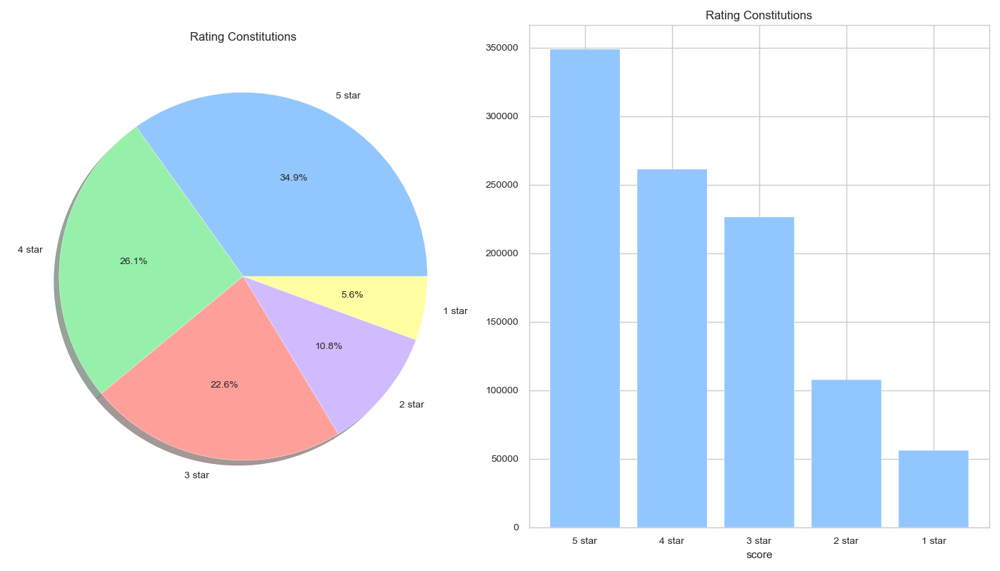
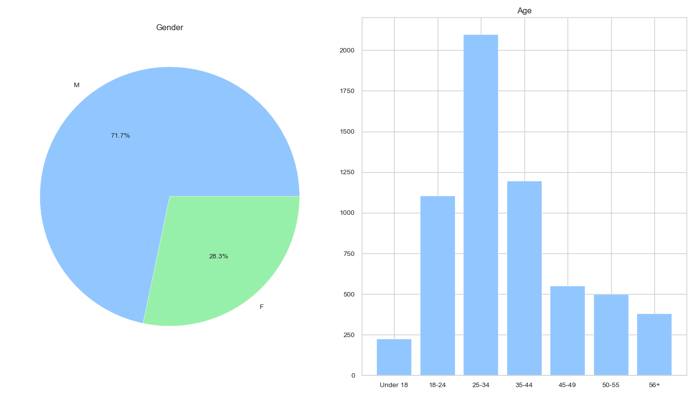
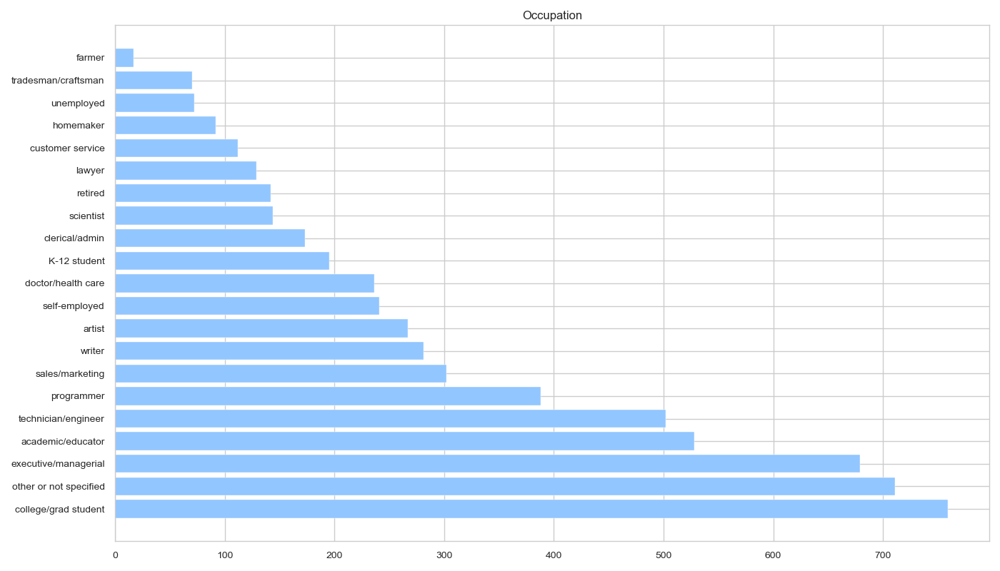

# 7008 project
Group Project of Stat7008, 2023 Fall, HKU  
Recommendation system

# OverView
A recommender system is a subclass of information filtering system that seeks to predict the "rating" or "preference" a user would give to an item. It is commonly used in various online platforms, such as e-commerce websites, streaming services, and social media platforms. The primary goal of a recommendation system is to provide personalized and targeted recommendations to users, ultimately enhancing their experience and helping them find what they are looking for. These recommendations are generated by analyzing and understanding user data, such as previous actions, preferences, demographic information, and feedback.

 
 

# Dataset
[MovieLens 1M Dataset](https://grouplens.org/datasets/movielens/1m/) has been used for this project. MovieLens is a rating dataset from the MovieLens website. MovieLens data sets were collected by the GroupLens Research Project at the University of Minnesota.

This data set consists of:

### ratings.dat
anonymous ratings (1-5) of approximately 3,900 movies made by 6,040 MovieLens users. Users are numbered consecutively from 1. This is a table of "UserID :: MovieID :: Rating :: Timestamp".  

### users.dat
Infromation of users. This is a table of "UserID :: Gender :: Age :: Occupation :: Zip-code".  

### movies.dat
Information about the movies. This is a table of "MovieID :: Title :: Genres", where Genres are pipe-separated and are selected from the following 18 genres: action | adventure | animation | children's | comedy | crime | documentary | drama | fantasy | film-noir | horror | musical | mystery | romance | sci-fi | thriller | war | western.

Movies can be in several genres at once.

## Data Visualizations
Rating: Users are quite positive in general (give 4,5 ratings).

 
 

  

Movie Type: Drama and comedy are the most "popular" movie types. Although we can't distinguish positive or negative comments, at least we can know that movie makers are in favor of these two types.

 
 

  

Gender and Age: Male dominates, 25-39 years old users contribute most.

 
 

  

Occupation: Students contribute most.

 
 

